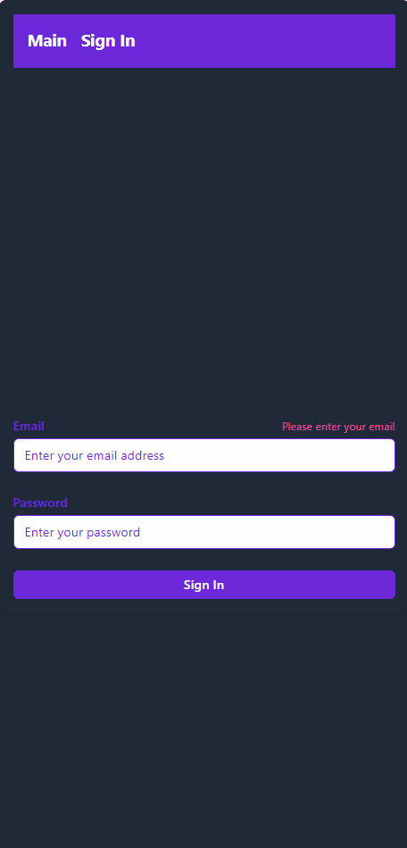

# Project Overview

## Description
This project is a comprehensive web application designed to demonstrate modern development practices and technologies. It showcases a React application with a focus on clean architecture, component reusability, and efficient state management. Key features include an authentication system and a responsive UI using Tailwind CSS and Radix UI.

## Key Features
- **React & TypeScript**: Utilized React and TypeScript for a robust and type-safe frontend.
- **State Management**: Integrated dependency injection and service management with a custom Container class.
- **Routing**: Implemented dynamic routing with `@tanstack/react-router`.
- **Authentication**: Developed an authentication flow with sign-in and user profile management.
- **UI/UX**: Designed a modern UI with Tailwind CSS and Radix UI, including responsive layouts and styled components.
- **Testing**: Configured and wrote unit and integration tests using Vitest and React Testing Library.
- **Error Handling & Validation**: Included error handling and validation with detailed user feedback.

## Installation

1. Clone the repository:
    ```bash
    git clone https://github.com/yourusername/your-repo.git
    cd your-repo
    ```

2. Install dependencies:
    ```bash
    npm install
    ```

3. Run the development server:
    ```bash
    npm run dev
    ```

4. Open your browser and navigate to [http://localhost:3000](http://localhost:3000) to view the application.

## Project Structure
- **`src/`** - Contains the application source code.
  - **`components/`** - Reusable UI components.
  - **`features/`** - Feature-specific code, including hooks and contexts.
  - **`pages/`** - Page components and routing logic.
  - **`core/`** - Core services and dependency injection setup.
- **`public/`** - Public assets and `index.html` file.
- **`tests/`** - Test files and configurations.

## Technologies
- **React** - Frontend library for building user interfaces.
- **TypeScript** - Static type checking for JavaScript.
- **Tailwind CSS** - Utility-first CSS framework for custom styling.
- **Radix UI** - Low-level UI components for building accessible design systems.
- **@tanstack/react-router** - Powerful routing library for React.
- **Vitest** - Testing framework for unit and integration tests.
- **PostCSS** - Tool for transforming CSS with JavaScript plugins.

## Info that you should know

- Email: admin@gmail.com
- Password: password


## Testing
Test will added with future realise...

[//]: # (Run tests with:)

[//]: # (```bash)

[//]: # (npm run test)

[//]: # (```)
## Demo

